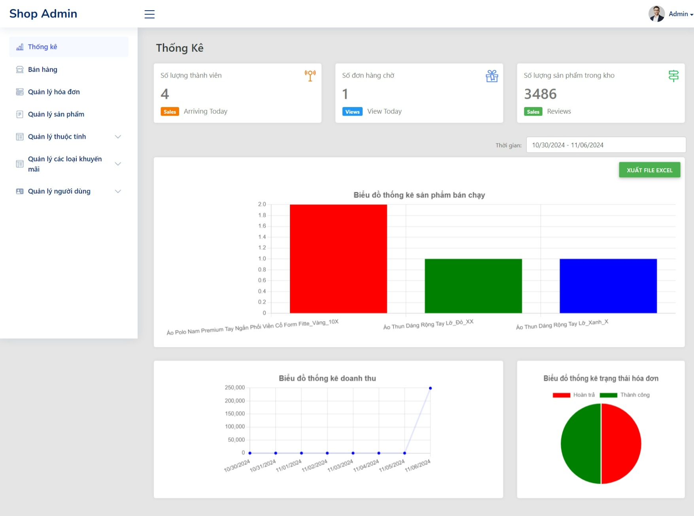

# ĐỒ ÁN C# (.cs) SGU
Sử dụng ASP.NET, HTML,CSS,Bootstrap,JQuery, MS SQL server
# CỬA HÀNG BÁN QUẦN ÁO TÍCH HỢP THANH TOÁN VNPAY

### THÀNH VIÊN NHÓM
| STT |    MSSV    | Họ và tên                                                                   | Lớp |
| :-: | :--------: | --------------------------------------------------------------------------- | -------- |
|  1  | 3122411174 | [Lê Song Nhật Quyền](https://www.facebook.com/songquyen.it.vn)              | DCT122C3 |
|  2  | 3122411109 | [Trương Phú Kiệt](https://www.facebook.com/kiet.chuong.54)                  | DCT122C3 |
|  3  | 3122411145 | [Lê Hồng Phát](https://www.facebook.com/fatle44)                            | DCT122C3 |
|  4  | 3122411206 | [Trần Minh Trí](https://www.facebook.com/Pykechu)                           | DCT122C3 |

## TRANG CHU 

## ADMIN

# Lưu ý: 
- Link repository: https://github.com/DavidMaxvn/DoAn-CSharp-SGU/
- Link video demo: https://drive.google.com/file/d/19IioqYZsi4WnFOncRgqvTMJoSish5JRI/preview

# Các tài khoản và lưu ý:
- tài khoản VNPAY: ngân hàng NCB, số thẻ: 9704198526191432198, tên chủ tk: NGUYEN VAN A, hạn thẻ: 07/15, mã OTP: 123456
- tài khoản admin: admin@gmail.com, pass: Admin@123
- tài khoản client: lesongnhatquyen@gmail.com, pass: Demo@123
- Sửa dòng tại: ...\DoAn-KTPM-SGU\AppAPI\appsettings.json và ...\DoAn-KTPM-SGU\AppData\Models\AssignmentDBContext.cs với String-Connection url hợp lệ trong SQL server!
- File SQL sửa C:\Program File\...\Data theo đường dẫn thư mục trên máy của bạn
